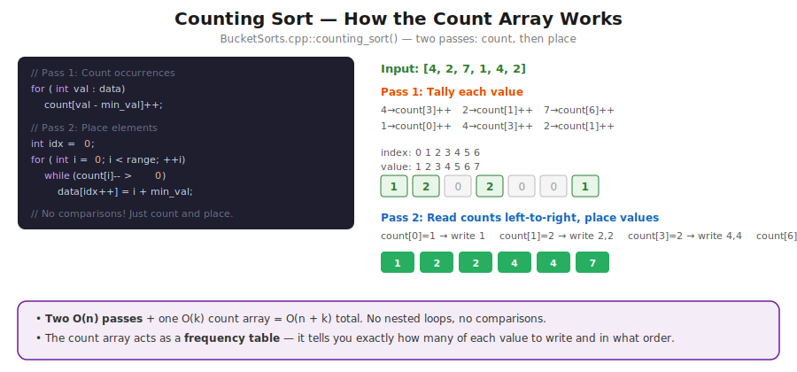
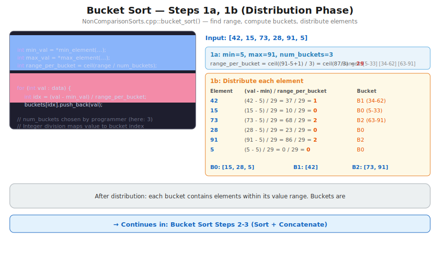
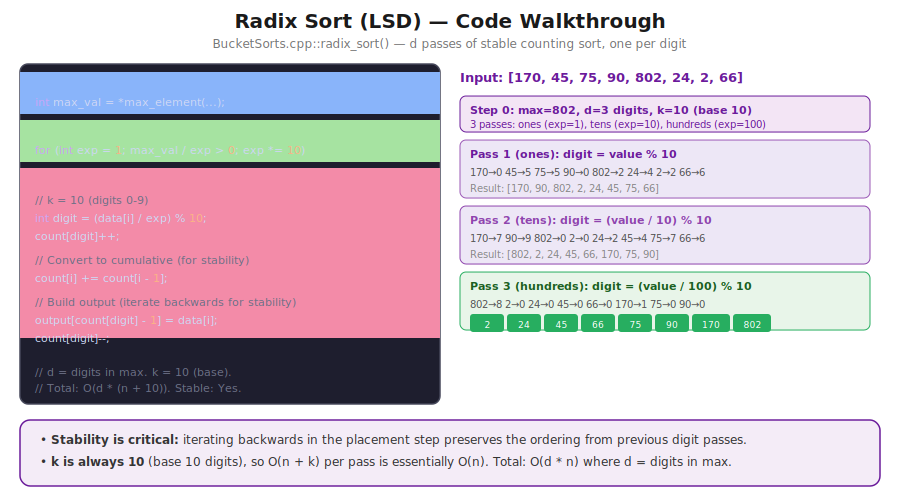

# CT14 -- Implementation Diagrams

Code-block diagrams referenced from `BucketSorts.cpp`.

---

## 1. Counting Sort -- Code Walkthrough
*`BucketSorts.cpp::counting_sort()` -- Step 1a: find min/max, Step 1b: allocate count array, Step 1c: tally, Step 2: place*

---

## 2. Bucket Sort -- Code Walkthrough
*`BucketSorts.cpp::bucket_sort()` -- Step 1a: find range, Step 1b: distribute, Step 2: sort buckets, Step 3: concatenate*

---

## 3. Radix Sort -- Code Walkthrough
*`BucketSorts.cpp::radix_sort()` -- Step 0: find max/d/k, then d passes of stable counting sort by digit*

