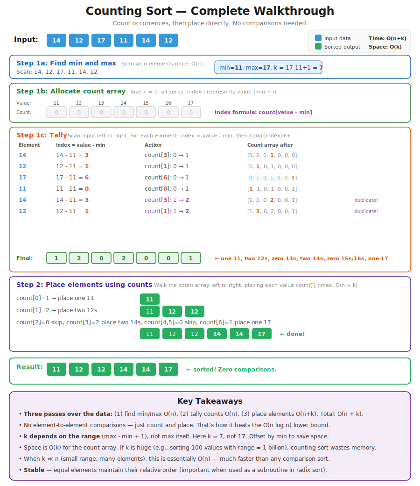
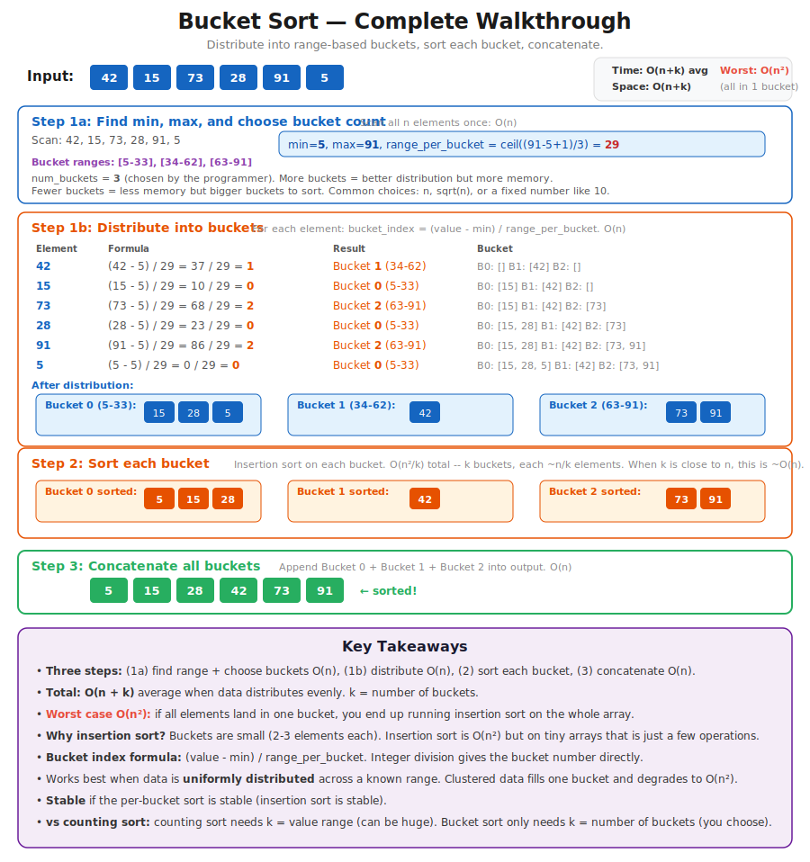
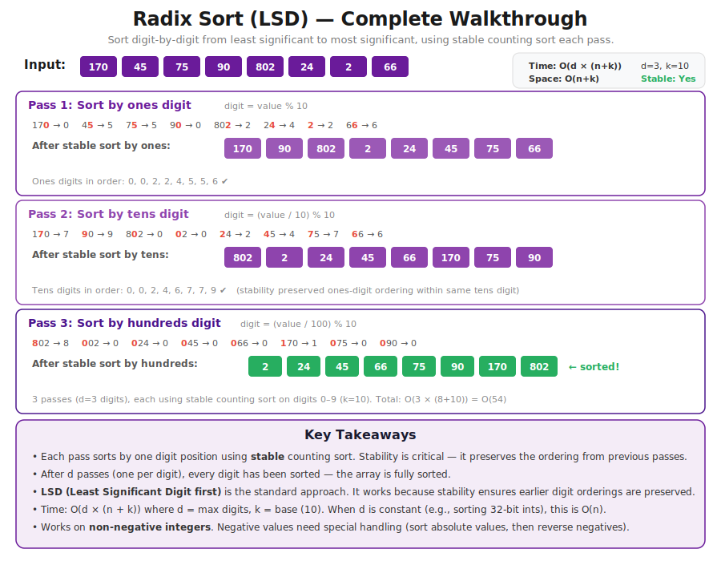

# CT14 -- Header Diagrams

Conceptual diagrams referenced from `BucketSorts.h`.

---

## 1. The Three Non-Comparison Sorts
*`BucketSorts.h` -- what counting sort, bucket sort, and radix sort are and how they work at a high level*

---

## 2. What Is k? The Value Range
*`BucketSorts.h` -- k determines whether non-comparison sorts beat O(n log n). Small k = fast. Huge k = use quick sort instead.*

---

## 3. Counting Sort -- Complete Walkthrough
*`BucketSorts.h` -- step-by-step on [14, 12, 17, 11, 14, 12] showing count array and placement (min=11, max=17, k=7)*

---

## 4. Bucket Sort -- Complete Walkthrough
*`BucketSorts.h` -- distributing [42, 15, 73, 28, 91, 5] into 3 buckets, sort each, concatenate*

---

## 5. Radix Sort (LSD) -- Complete Walkthrough
*`BucketSorts.h` -- sorting [170, 45, 75, 90, 802, 24, 2, 66] digit-by-digit with 3 passes*

---

## 6. Non-Comparison Sorts -- Side-by-Side Comparison
*`BucketSorts.h` -- time, space, stability, and best-use at a glance*

